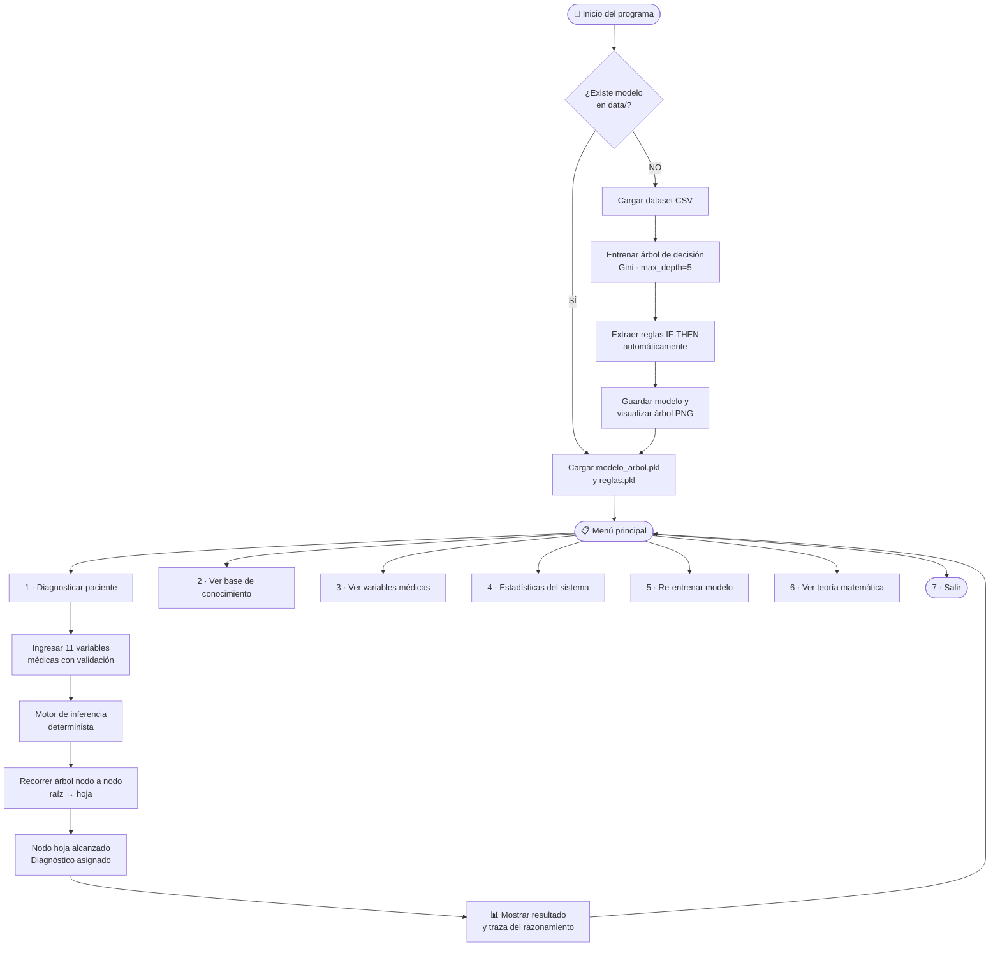
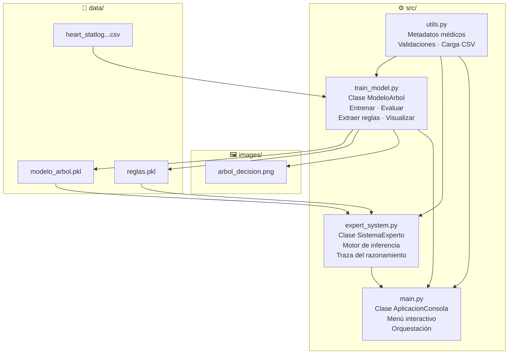
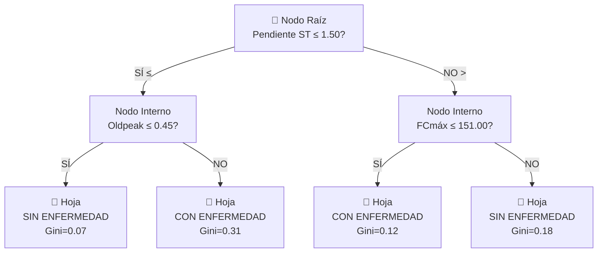
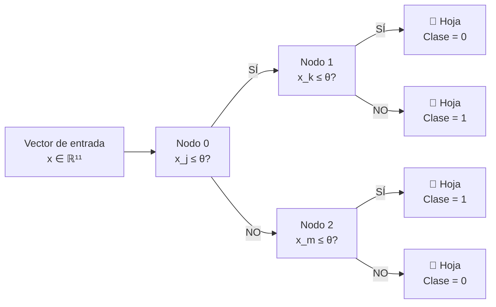

# 🫀 Sistema Experto Determinista — Diagnóstico de Enfermedades Cardíacas

> **Proyecto Académico** · Inteligencia Artificial Simbólica  
> Árbol de Decisión · Reglas IF-THEN · Inferencia Determinista


---

## Índice

1. [Introducción](#introducción)
2. [Objetivo](#objetivo)
3. [Sistema Experto Determinista](#sistema-experto-determinista)
4. [IA Simbólica](#ia-simbólica)
5. [Dataset](#dataset)
6. [Variables Médicas](#variables-médicas)
7. [Flujo del Programa](#flujo-del-programa)
8. [Arquitectura del Sistema](#arquitectura-del-sistema)
9. [Árbol de Decisión](#árbol-de-decisión)
10. [Fórmulas Matemáticas](#fórmulas-matemáticas)
11. [Ejemplos de Ejecución](#ejemplos-de-ejecución)
12. [Cómo Ejecutar el Proyecto](#cómo-ejecutar-el-proyecto)
13. [Por qué es Determinista](#por-qué-es-determinista)
14. [Ventajas y Limitaciones](#ventajas-y-limitaciones)
15. [Bibliografía](#bibliografía)

---

## Introducción

Este proyecto implementa un **Sistema Experto Determinista** para el diagnóstico de enfermedades cardíacas. A diferencia de sistemas modernos basados en redes neuronales o aprendizaje probabilístico, utiliza **IA Simbólica**: el conocimiento está representado explícitamente como reglas IF-THEN derivadas automáticamente de un árbol de decisión entrenado sobre datos reales.

El resultado es un sistema completamente **explicable**, **trazable** y **reproducible**: para cualquier combinación de variables médicas, el sistema produce siempre el mismo diagnóstico y puede explicar exactamente qué condiciones llevaron a esa conclusión.

---

## Objetivo

Desarrollar un sistema capaz de:

- ✅ Aprender automáticamente a partir de un dataset real de enfermedades cardíacas
- ✅ Generar reglas de diagnóstico interpretables en lenguaje IF-THEN
- ✅ Evaluar a un paciente recorriendo determinísticamente el árbol de decisión
- ✅ Explicar en detalle el razonamiento utilizado para llegar al diagnóstico
- ✅ Servir como herramienta de apoyo académico para comprender la IA simbólica

---

## Sistema Experto Determinista

Un **sistema experto** es un programa que simula la capacidad de razonamiento de un experto humano en un dominio específico. Sus componentes son:

| Componente | Descripción | Implementación en este proyecto |
|---|---|---|
| **Base de conocimiento** | Conjunto de reglas y hechos del dominio | Reglas IF-THEN extraídas del árbol de decisión |
| **Motor de inferencia** | Mecanismo que aplica las reglas a los datos de entrada | Recorrido determinista nodo a nodo del árbol |
| **Base de hechos** | Datos del caso actual que se está evaluando | Variables médicas del paciente ingresadas por consola |
| **Módulo de explicación** | Justificación del razonamiento empleado | Traza completa de cada nodo recorrido |

El sistema es **determinista** porque:
- No utiliza probabilidades en la fase de inferencia
- El árbol de decisión tiene una única ruta posible para cada entrada
- Para los mismos valores de entrada, siempre se produce el mismo diagnóstico

---

## IA Simbólica

La **Inteligencia Artificial Simbólica** (también llamada IA clásica o GOFAI — *Good Old-Fashioned AI*) representa el conocimiento mediante estructuras explícitas: reglas lógicas, árboles, grafos y ontologías.

**Contraste con IA conexionista:**

| Característica | IA Simbólica *(este proyecto)* | IA Conexionista *(redes neuronales)* |
|---|---|---|
| Representación del conocimiento | Reglas IF-THEN explícitas | Pesos numéricos opacos |
| Explicabilidad | Total — cada decisión es auditable | Limitada — "caja negra" |
| Determinismo | Garantizado por diseño | Depende de la arquitectura |
| Volumen de datos necesario | Pocos miles de registros | Millones de ejemplos |
| Interpretación por no expertos | Directa y legible | Requiere SHAP, LIME u otras técnicas |

---

## Dataset

| Campo | Valor |
|---|---|
| **Nombre** | Heart Statlog Cleveland Hungary Final |
| **Fuente** | [Kaggle — Enfermedades del Corazón](https://www.kaggle.com/datasets/oliverquiros/enfermedades-del-corazon) |
| **Origen** | Combinación de datasets Cleveland, Hungarian y Statlog (UCI ML Repository) |
| **Total de registros** | 1 190 pacientes |
| **Variables de entrada** | 11 variables médicas |
| **Variable objetivo** | `target` — 0 = Sin enfermedad · 1 = Con enfermedad |
| **Tipo de problema** | Clasificación binaria supervisada |
| **Balance de clases** | ~47% clase 0 · ~53% clase 1 |

---

## Variables Médicas

| # | Variable (columna) | Tipo | Rango | Descripción e influencia |
|---|---|---|---|---|
| 1 | `age` | Entero (años) | 1 – 120 | Edad del paciente. A mayor edad, mayor deterioro arterial y riesgo de aterosclerosis. |
| 2 | `sex` | Binario | 0 = Femenino · 1 = Masculino | El sexo masculino presenta mayor incidencia coronaria antes de los 55 años. |
| 3 | `chest pain type` | Categórico | 1 – 4 | 1 = Angina típica · 2 = Atípica · 3 = No anginoso · 4 = Asintomático. La angina típica es el síntoma más específico de isquemia. |
| 4 | `resting bp s` | Entero (mmHg) | 50 – 250 | Presión arterial sistólica en reposo. Valores >140 mmHg indican hipertensión. |
| 5 | `cholesterol` | Entero (mg/dl) | 0 – 600 | Colesterol sérico total. >240 mg/dl es riesgo alto de aterosclerosis coronaria. |
| 6 | `fasting blood sugar` | Binario | 0 = ≤120 mg/dl · 1 = >120 mg/dl | Indicador indirecto de diabetes. La hiperglucemia daña el endotelio vascular. |
| 7 | `resting ecg` | Categórico | 0 – 2 | 0 = Normal · 1 = Anomalía ST-T · 2 = Hipertrofia ventricular izquierda. |
| 8 | `max heart rate` | Entero (lpm) | 60 – 220 | FCmáx alcanzada en prueba de esfuerzo. Baja FCmáx sugiere menor reserva cardíaca. |
| 9 | `exercise angina` | Binario | 0 = No · 1 = Sí | Angina durante ejercicio: síntoma clásico de obstrucción coronaria >70%. |
| 10 | `oldpeak` | Decimal (mm) | 0.0 – 10.0 | Depresión del segmento ST por ejercicio. ≥1 mm es criterio diagnóstico de isquemia. |
| 11 | `ST slope` | Categórico | 0 – 3 | 0 = N/A · 1 = Ascendente · 2 = Horizontal · 3 = Descendente (altamente patológico). |

---

## Flujo del Programa



---

## Arquitectura del Sistema



### Responsabilidades de cada módulo

| Módulo | Clase principal | Responsabilidad |
|---|---|---|
| `utils.py` | — | Metadatos de variables médicas, carga de CSV, validación de entradas |
| `train_model.py` | `ModeloArbol` | Entrenamiento, evaluación, extracción de reglas, visualización del árbol |
| `expert_system.py` | `SistemaExperto` | Motor de inferencia determinista, traza del razonamiento |
| `main.py` | `AplicacionConsola` | Menú interactivo de consola, orquestación general |

---

## Árbol de Decisión

### ¿Qué es un árbol de decisión?



- **Nodos internos** — Evalúan una condición sobre una variable (`valor ≤ umbral`)
- **Ramas izquierdas** — Condición verdadera (`≤ umbral`)
- **Ramas derechas** — Condición falsa (`> umbral`)
- **Hojas** — Decisión final: clase mayoritaria de los ejemplos de entrenamiento en ese subconjunto

### Hiperparámetros del árbol

| Hiperparámetro | Valor | Justificación |
|---|---|---|
| `criterion` | `gini` | Criterio estándar para clasificación binaria |
| `max_depth` | `5` | Evita sobreajuste, mantiene el árbol legible |
| `min_samples_leaf` | `10` | Evita reglas basadas en casos aislados |
| `random_state` | `42` | Garantiza reproducibilidad total |

### Resultados obtenidos

| Métrica | Valor |
|---|---|
| Dataset total | 1 190 pacientes |
| Conjunto de entrenamiento | 952 (80%) |
| Conjunto de prueba | 238 (20%) |
| **Exactitud (Accuracy)** | **84.45%** |
| Nodos totales | 55 |
| Hojas (reglas generadas) | **28** |
| Profundidad real | 5 niveles |

---

## Fórmulas Matemáticas

### 1 · Índice de Gini

Mide la impureza de un nodo. Gini = 0 significa nodo perfectamente puro.

$$\text{Gini}(t) = 1 - \sum_{i=1}^{K} p(i \mid t)^2$$

**Ejemplo:**
- Nodo con 70% clase 1 y 30% clase 0:

$$\text{Gini} = 1 - (0.70^2 + 0.30^2) = 1 - 0.58 = 0.42 \quad \text{(impuro)}$$

- Nodo 100% clase 1:

$$\text{Gini} = 1 - 1.00^2 = 0 \quad \text{(puro)}$$

### 2 · Entropía de Shannon

Medida de incertidumbre. Máxima en distribución 50/50, mínima en nodo puro.

$$H(t) = -\sum_{i=1}^{K} p(i \mid t) \cdot \log_2 p(i \mid t)$$

| Distribución | Entropía |
|---|---|
| 50% / 50% | $H = 1.0$ bit (máxima incertidumbre) |
| 100% una clase | $H = 0$ bits (certeza total) |

### 3 · Ganancia de Información

Cuantifica cuánto reduce la impureza dividir por un atributo $A$:

$$\text{IG}(A, t) = H(t) - \sum_{j} \frac{|t_j|}{|t|} \cdot H(t_j)$$

El árbol selecciona en cada nodo el atributo $A^*$ que **maximiza** la ganancia:

$$A^* = \arg\max_{A} \; \text{IG}(A, t)$$

### 4 · Gini ponderado de un split

$$\text{Gini}_{\text{split}} = \frac{|t_L|}{|t|} \cdot \text{Gini}(t_L) + \frac{|t_R|}{|t|} \cdot \text{Gini}(t_R)$$

Se selecciona el split que **minimiza** este valor.

### 5 · Inferencia determinista

Dado el árbol $T$ y un vector de entrada $\mathbf{x} \in \mathbb{R}^{11}$:

$$\hat{y} = T(\mathbf{x}) = \text{clase\_hoja}(n^*)$$

donde $n^*$ se alcanza siguiendo:

$$n_{k+1} = \begin{cases} \text{hijo\_izq}(n_k) & \text{si } x_{f(n_k)} \leq \theta_{n_k} \\ \text{hijo\_der}(n_k) & \text{si } x_{f(n_k)} > \theta_{n_k} \end{cases}$$

---

## Ejemplos de Ejecución

### Caso 1 — Paciente de alto riesgo

```
Datos ingresados:
  Edad                        : 63
  Sexo                        : 1  (Masculino)
  Tipo de dolor de pecho      : 4  (Asintomático)
  Presión arterial en reposo  : 145 mmHg
  Colesterol sérico           : 233 mg/dl
  Azúcar en sangre en ayunas  : 1  (> 120 mg/dl)
  ECG en reposo               : 0  (Normal)
  Frecuencia cardíaca máxima  : 150 lpm
  Angina por ejercicio        : 0  (No)
  Oldpeak (depresión ST)      : 2.3 mm
  Pendiente ST                : 3  (Descendente)

════════════════════════════════════════
  DIAGNÓSTICO: POSIBLE ENFERMEDAD CARDÍACA
════════════════════════════════════════

Traza del razonamiento:
  Paso 1 | Nodo 000 | Pendiente ST ≤ 1.50?       → ✗ NO  (valor: 3)   → rama derecha
  Paso 2 | Nodo 004 | FCmáx ≤ 151.00?            → ✓ SÍ  (valor: 150) → rama izquierda
  Paso 3 | Nodo 008 | Oldpeak ≤ 0.75?            → ✗ NO  (valor: 2.3) → rama derecha
  Hoja alcanzada: CON ENFERMEDAD | Gini=0.12 | Confianza=94%

Regla activada:
  SI    Pendiente ST > 1.50
  AND   FCmáx ≤ 151.00
  AND   Oldpeak > 0.75
  ENTONCES: CON ENFERMEDAD CARDÍACA
```

### Caso 2 — Paciente de bajo riesgo

```
Datos ingresados:
  Edad                        : 35
  Sexo                        : 0  (Femenino)
  Tipo de dolor de pecho      : 2  (Angina atípica)
  Presión arterial en reposo  : 118 mmHg
  Colesterol sérico           : 182 mg/dl
  Azúcar en sangre en ayunas  : 0  (Normal)
  ECG en reposo               : 0  (Normal)
  Frecuencia cardíaca máxima  : 174 lpm
  Angina por ejercicio        : 0  (No)
  Oldpeak (depresión ST)      : 0.0 mm
  Pendiente ST                : 1  (Ascendente)

════════════════════════════════════════
  DIAGNÓSTICO: SIN ENFERMEDAD CARDÍACA
════════════════════════════════════════

Traza del razonamiento:
  Paso 1 | Nodo 000 | Pendiente ST ≤ 1.50?       → ✓ SÍ  (valor: 1)   → rama izquierda
  Paso 2 | Nodo 001 | Oldpeak ≤ 0.45?            → ✓ SÍ  (valor: 0.0) → rama izquierda
  Paso 3 | Nodo 002 | Tipo de dolor ≤ 3.50?      → ✓ SÍ  (valor: 2)   → rama izquierda
  Hoja alcanzada: SIN ENFERMEDAD | Gini=0.07 | Confianza=96%

Regla activada:
  SI    Pendiente ST ≤ 1.50
  AND   Oldpeak ≤ 0.45
  AND   Tipo de dolor ≤ 3.50
  ENTONCES: SIN ENFERMEDAD CARDÍACA
```

---

## Cómo Ejecutar el Proyecto

### Requisitos

- Python 3.8 o superior
- pip

### Instalación

```bash
# 1. Clonar el repositorio
git clone https://github.com/Goryachyin/se-problemas-cardiacos.git
cd se-problemas-cardiacos

# 2. Instalar dependencias
pip install -r requirements.txt
```

### Ejecutar el sistema experto

```bash
cd src
python main.py
```

> **Primera ejecución:** entrena el árbol, genera las reglas, guarda `tree.png` y serializa el modelo.  
> **Ejecuciones posteriores:** carga el modelo directamente (inicio rápido).

### Solo entrenar el modelo

```bash
cd src
python train_model.py
```

Archivos generados:

| Archivo | Descripción |
|---|---|
| `data/modelo_arbol.pkl` | Árbol de decisión serializado |
| `data/reglas.pkl` | Lista de 28 reglas IF-THEN |
| `images/arbol_decision.png` | Visualización completa del árbol |
| `tree.png` | Copia del árbol en la raíz del proyecto |

---

## Por qué es Determinista



El sistema garantiza **determinismo total** mediante tres mecanismos:

**1 · Semilla fija en entrenamiento**
```python
DecisionTreeClassifier(random_state=42)
train_test_split(..., random_state=42)
```
El mismo dataset siempre produce el mismo árbol.

**2 · Inferencia sin aleatoriedad**

El recorrido es una función matemática pura:
```
f(x)  →  camino único  →  hoja única  →  clase única
```

**3 · Reglas booleanas deterministas**

Cada regla IF-THEN es una conjunción de condiciones booleanas. Para un vector `x` dado, exactamente **una** ruta del árbol es posible y siempre asigna la misma clase.

---

## Ventajas y Limitaciones

### ✅ Ventajas

| Ventaja | Descripción |
|---|---|
| **Explicabilidad total** | Cada decisión puede rastrearse hasta las condiciones originales |
| **Determinismo garantizado** | Sin componentes aleatorios en la inferencia |
| **Eficiencia** | Inferencia en O(profundidad) — extremadamente rápida |
| **Auditabilidad** | Médicos y reguladores pueden revisar todas las reglas |
| **Sin caja negra** | No hay parámetros ocultos ni representaciones latentes |
| **Pocos datos suficientes** | Funciona bien con datasets de cientos de registros |

### ⚠️ Limitaciones

| Limitación | Descripción |
|---|---|
| **Fronteras ortogonales** | El árbol solo crea divisiones paralelas a los ejes |
| **Riesgo de sobreajuste** | Sin `max_depth`, el árbol puede memorizar datos de entrenamiento |
| **Discretización** | Los umbrales sobre variables continuas pueden perder información |
| **Inestabilidad** | Un árbol individual puede ser sensible a pequeñas variaciones en los datos |
| **Interacciones no lineales** | Relaciones complejas entre variables pueden no capturarse |

### ¿Cuándo usar este enfoque?

| ✅ Recomendado | ❌ No recomendado |
|---|---|
| Explicabilidad es requisito (medicina, derecho, finanzas) | Datos masivos con patrones muy no lineales |
| Dataset moderado (< 100 000 registros) | Alta dimensionalidad (> 100 variables) |
| Se necesita auditar cada decisión | Rendimiento como única prioridad |
| Entornos académicos o de investigación | Imágenes, audio o texto sin procesar |

---

## Bibliografía

1. **Breiman, L., Friedman, J., Olshen, R., & Stone, C.** (1984). *Classification and Regression Trees*. Wadsworth & Brooks/Cole.
2. **Quinlan, J. R.** (1986). Induction of Decision Trees. *Machine Learning*, 1(1), 81–106.
3. **Russell, S., & Norvig, P.** (2020). *Artificial Intelligence: A Modern Approach* (4th ed.). Pearson.
4. **Pedregosa, F., et al.** (2011). Scikit-learn: Machine Learning in Python. *Journal of Machine Learning Research*, 12, 2825–2830.
5. **Gini, C.** (1912). *Variabilità e mutabilità*. Tipografia di Paolo Cuppini, Bologna.
6. **Shannon, C. E.** (1948). A Mathematical Theory of Communication. *Bell System Technical Journal*, 27(3), 379–423.
7. **UCI Machine Learning Repository** — Heart Disease Dataset. Frank, A., & Asuncion, A. (2010). University of California, Irvine.
8. **World Health Organization.** (2023). *Cardiovascular Diseases — Key Facts*. https://www.who.int/news-room/fact-sheets/detail/cardiovascular-diseases-(cvds)
9. **Hayes-Roth, F., Waterman, D. A., & Lenat, D. B.** (1983). *Building Expert Systems*. Addison-Wesley.
10. **Mitchell, T. M.** (1997). *Machine Learning*. McGraw-Hill. Chapter 3: Decision Tree Learning.

---

> ⚠️ **Nota académica:** Este sistema es una herramienta educativa. No debe utilizarse como sustituto del diagnóstico médico profesional. Siempre consulte a un médico especialista para evaluaciones cardíacas reales.
